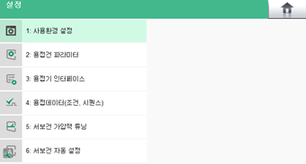

# 9.3 스폿용접 펑션

프로그램 작성 중 SPOT 명령문을 기록했을 때, 수동 모드에서 스폿용접 펑션 위치에 커서를 두고 \[속성\] 버튼을 터치하면 스폿용접의 메뉴 화면이 표시됩니다. 서보건의 설정이나 용접 조건과 용접 시퀀스 등의 내용을 빠르게 수정할 수 있습니다.


* \[**시스템**\] 버튼 &gt; \[4: 응용 파라미터 &gt; 1: 스폿용접\] 메뉴를 터치하여 스폿용접 기능을 사용할 수 있습니다.
* 스폿용접 기능에 대한 자세한 내용은 “[Hi6 제어기 스폿용접 기능 설명서](https://hrbook-hrc.web.app/#/view/doc-spot-weld/korean/README)”를 참조하십시오.


