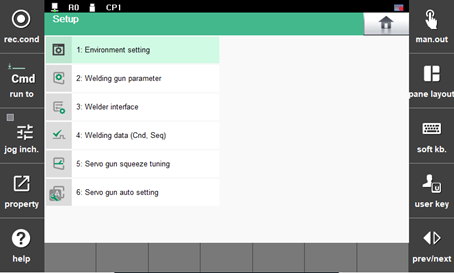

# 9.3 Spot Welding Function

When writing the SPOT command while writing the program, if you place the cursor on the spot welding function position in manual mode and touch the \[property\] button, then the \[1: Spot Welding\] menu will be highlighted in the application parameter setting menu screen. Using the spot welding function, you can quickly modify the contents of the welding conditions and also of the welding sequence when performing spot welding.


* You can use the spot welding function by touching the \[Set Up\] button &gt; \[4: Application Parameter &gt; 1: Spot Welding\].
* 
  For details on the spot welding function, refer to the “Hi6 Controller Spot Welding Function Manual.”


