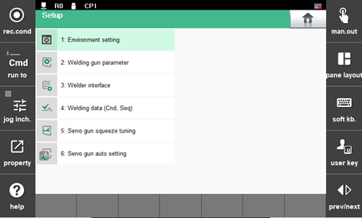

# 9.3 点焊功能

在编写程序时，如果您在手动模式下将光标放置在点焊功能的位置，并触摸 `[property]` 按钮，则 `[1: 点焊]` 菜单将在应用程序参数设置菜单屏幕中高亮显示。使用点焊功能，您可以快速修改焊接条件的内容以及在进行点焊时的焊接顺序。


* 您可以通过触摸 `[system]` 按钮 - `[4: 应用程序参数 - 1: 点焊] ([4: Application Parameter  - 1: Spot Welding])` 来使用点焊功能。
* 
  有关点焊功能的详细信息，请参考 "[${cont_model} 控制器点焊功能手册](https://hrbook-hrc.web.app/#/view/doc-spot-weld/zh/README)"。
