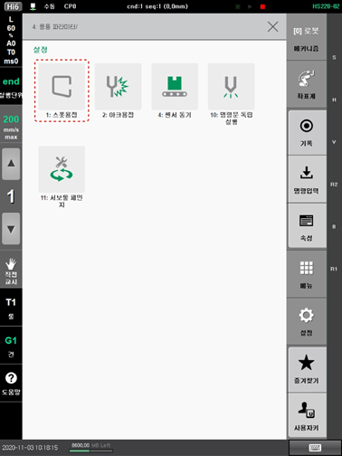

# 9.3 스폿용접 펑션

프로그램 작성 중 SPOT 명령문을 기록했을 때, 수동 모드에서 스폿용접 펑션 위치에 커서를 두고 \[속성\] 버튼을 터치하면 응용 파라미터의 설정 메뉴 화면에서 \[1: 스폿용접\] 메뉴가 하이라이트 표시됩니다. 스폿용접 기능을 이용하면, 서보건으로 스폿용접할 때, 용접 조건과 용접 시퀀스의 내용을 빠르게 수정할 수 있습니다.


* \[설정\] 버튼 &gt; \[4: 응용 파라미터 &gt; 1: 스폿용접\] 메뉴를 터치하여 스폿용접 기능을 사용할 수 있습니다.
* 스폿용접 기능에 대한 자세한 내용은 “Hi6 제어기 스폿용접 기능 설명서”를 참조하십시오.


