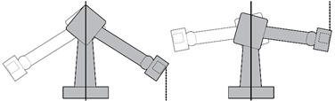
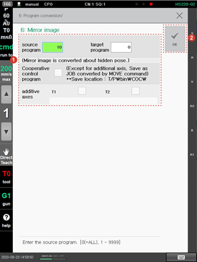

# 4.3.6 Mirror Image

You can write a program in which the position of the S axis and the posture of the wrist axis are symmetrical based on the Y-Z plane at the 0° position of the S axis of the robot.

This function is useful when instructing two robots on the left and right to perform the same operation, such as welding the body of a vehicle. First, teach an operation to one robot and then open the program of the taught operation and convert it into a mirror image. Then, a program symmetrical to the S axis will be written.


The mirror image function is not supported for collaborative robots.


The use of the \[6: Mirror Image\] menu will be restricted during the startup of the robot. The method to use the mirror image function is as follows.

1.	Touch the \[6: Program Conversion &gt; 6: Mirror Image\] menu. Then, the mirror image setting window will appear.

2.	After setting the mirror image conversion option, touch the \[OK\] button.

* \[Source program\]/\[Target program\]: You can set the number of the existing program and the number of the new program that is to be created through conversion using a mirror image.

