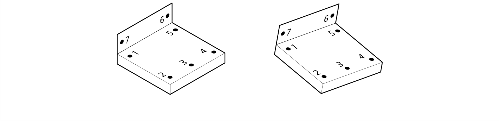
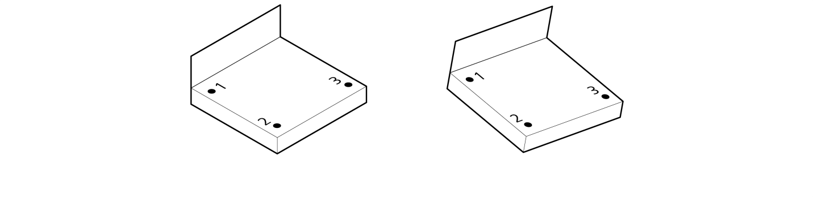
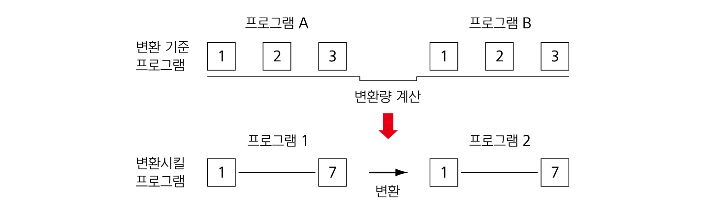
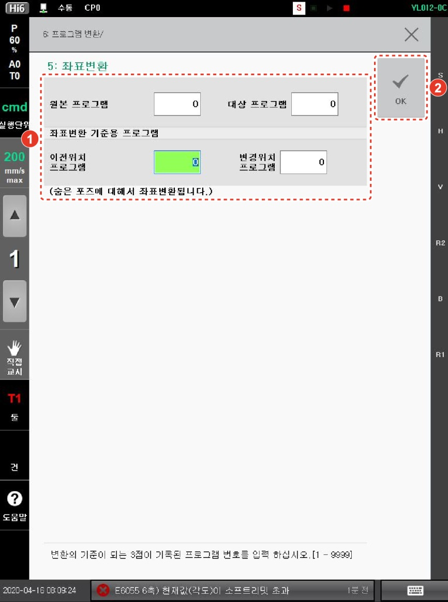

# 4.3.5 좌표 변환

좌표 변환 기능은 작업물(이미지 1)에 프로그램을 티칭한 이후에 이미지 2와 같이 동일한 모양의 작업물이 다른 위치에 있을 경우에도 별도의 티칭 없이 프로그램을 작성할 수 있게 해주는 기능입니다.
 
   

좌표 변환 기능을 사용하기 위해서는 3개의 기준점이 필요합니다. 초기 위치에서 작업물에 3개의 기준점을 표시하여 프로그램A를 작성합니다. 작업물의 위치를 이동한 후 미리 표시해 둔 3개의 기준점을 프로그램 B로 작성합니다.
 
   


* 좌표 변환의 세 기준점에 대한 티칭의 정도는 좌표 변환 프로그램의 정확도에 영향을 미칩니다. 가능한 한 3개의 기준점에 대해 정확하게 티칭하십시오.
* 좌표 변환의 3개의 기준점 사이의 거리는 가능한 한 멀게 설정하십시오.


프로그램 A와 프로그램 B의 기준이 되는 3 스텝에서 좌표 변환량을 계산하여 기존 프로그램(프로그램 1)을 새로운 프로그램(프로그램 2)으로 변환합니다.
 

로봇 기동 중에는 [5: 좌표변환] 메뉴의 사용이 제한됩니다. 좌표 변환 기능을 사용하는 방법은 다음과 같습니다.
1.	[6: 프로그램 변환 > 5: 좌표변환] 메뉴를 터치하십시오. 좌표 변환 설정창이 나타납니다.
2.	좌표 변환 옵션을 설정한 후 [OK] 버튼을 터치하십시오.
 
 

* [원본 프로그램]/[대상 프로그램]: 기존의 티칭 프로그램 번호(이미지 1의 프로그램 번호)와 좌표 변환을 수행하여 생성할 새 프로그램 번호(이미지 2의 프로그램 번호)를 설정합니다.
* [이전위치 프로그램]/[변경위치 프로그램]: 좌표 변환의 기준이 되는 3점이 기록된 프로그램 번호(프로그램 A의 번호)와 좌표 변환의 기준이 되는 3점이 기록된 프로그램 번호(프로그램 B의 번호)를 설정합니다.
