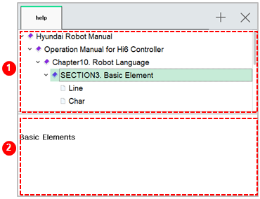

# 6.17 Help

In the panel selection window, touch \[Help\]. Then, you can check the usage information of the Hi6 controller in the help window of the controller.

<table>
  <thead>
    <tr>
      <th style="text-align:left">No.</th>
      <th style="text-align:left">Description</th>
    </tr>
  </thead>
  <tbody>
    <tr>
      <td style="text-align:left">
        
      </td>
      <td style="text-align:left">
        
List of help provided in the controller

        <ul>
          <li>[
            ]/[
            ]: You can hide or display the subitems.</li>
          <li>[
            ]: You can display the details of the selected item at the bottom.</li>
        </ul>
      </td>
    </tr>
    <tr>
      <td style="text-align:left">
        
      </td>
      <td style="text-align:left">Displays the details of the item selected in the above list of help</td>
    </tr>
  </tbody>
</table>

