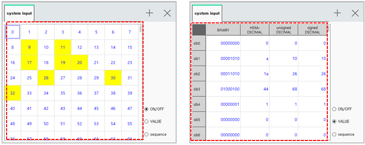
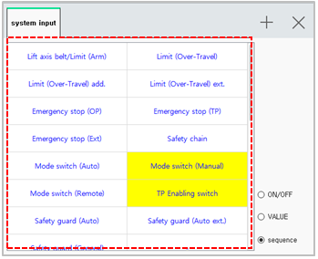

# 6.4 System Input

In the panel selection window, touch \[System Input\]. Then, the input signal window will appear. 

You can check the status of signals related to the robot operation and the status of the input signals preassigned to detect any abnormality that occurs to the robot and the controller.

* In the ON/OFF status and sequence status, the signals currently being inputted will be displayed in yellow.
* 
  In the sequence status, only the status of the controller sequence signals will be displayed.

* 
  \[ON/OFF\]/\[Value\]/\[Sequence\]: You can change the display mode of the input signal window by touching the radio button.

