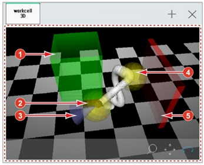
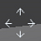

# 6.16 workcell

In the panel selection window, touch \[Work Cell\]. Then, the robot’s current posture will appear on the 3D screen.

By setting the safety function of the collaborative robot, you can check the setting status of the operation area \(\), tool area \(\), tool direction restriction \(\), robot elbow area \(\), prohibited area \(\).

* Select the \[Upscale/Downscale\] icon \(\), \[Move\] icon \(\), or \[Rotate\] icon \(\) at the bottom right of the 3D screen, and then drag the screen. Then, the camera will be adjusted.
* If the setting is changed, you can apply the new settings only after closing and reopening the workcell window.

