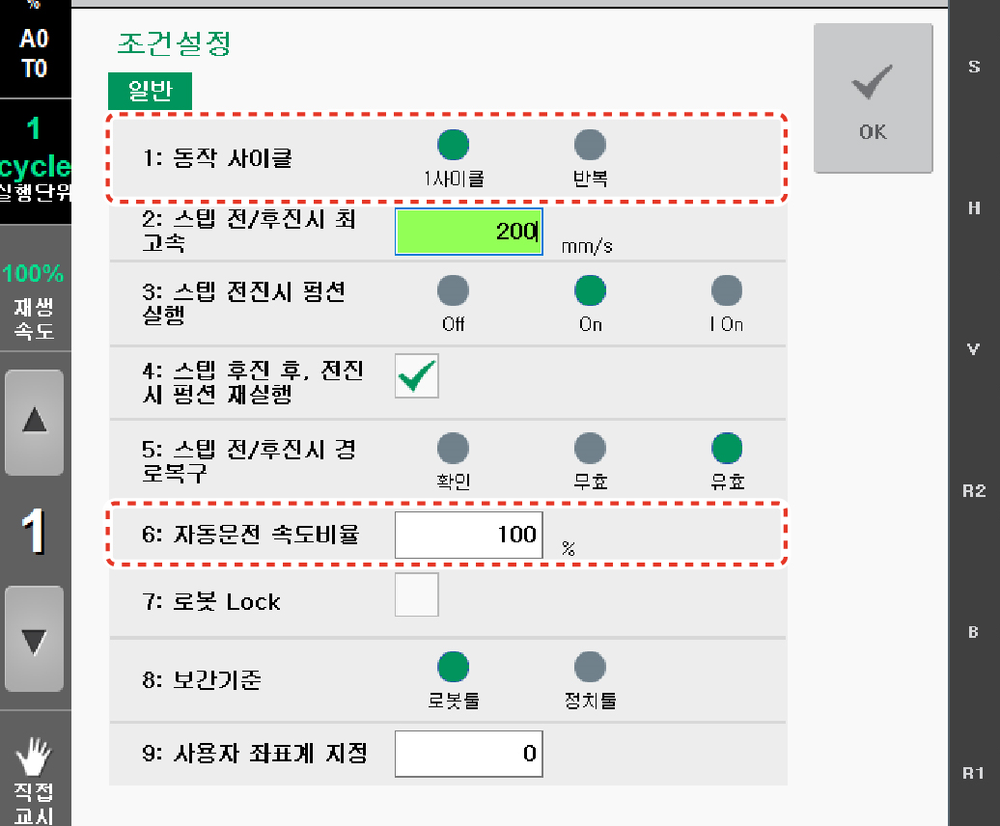

# 2.2.1 운전 방법

로봇에게 작업 내용을 교시하고 작업을 시키는 방법은 다음과 같습니다.

1.	안전 펜스와 로봇의 동작 범위 내에 사람 또는 장애물 유무를 확인하십시오. 

2.	티치 펜던트의 모드 스위치를 돌려 운전 방식을 자동 모드로 설정하십시오.

3.	Hi6 티치 펜던트 화면의 상태 표시줄에서 운전 방식이 자동 모드로 설정되어 있는지 확인하십시오.

* 수동 모드로 설정된 경우, 티치 펜던트의 모드 스위치를 돌려 운전 방식을 자동 모드로 설정하십시오

4.	초기 화면의 좌측에서 **\[조건설정\]** 버튼을 터치하십시오. 조건 설정창이 나타납니다.

5.	프로그램의 반복 옵션과 로봇의 운전 속도를 설정하십시오.

* **\[1: 동작 사이클\]**: 자동 운전 시 실행되는 프로그램의 반복 여부를 설정합니다.
* **\[6: 자동운전 속도비율\]**: 자동 모드에서 프로그램 재생 시 로봇의 운전 속도\(%\)를 설정합니다. 예를 들어, 운전 속도를 100으로 설정하면 스텝의 기록 속도로 로봇이 이동하고 50으로 설정하면 기록 속도의 50% 비율로 로봇이 이동합니다.

6.	티치 펜던트의 **&lt;시작&gt;** 키를 누르십시오. 시작 램프가 켜지고 로봇이 작성된 프로그램에 따라 작업을 수행합니다.

