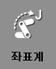
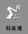
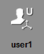
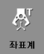

# 2.7.5 툴 좌표계

| 축 좌표계 | 로봇 좌표계 | 사용자 좌표계 | **툴 좌표계** |
| :---: | :---: | :---: | :---: |
|    |   |   |  |

1.	수동 모드에서 모터를 켜고 티치 펜던트 뒷면의 인에이블링 스위치를 잡으십시오.

2.	Hi6 티치 펜던트 화면 우측의 \[좌표계\] 버튼을 반복해서 터치하여 툴 좌표계를 선택하십시오. 조그 막대에 X, Y, Z, RX, RY, RZ와 부가축이 표시됩니다.

3.	조그키로 로봇을 동작하십시오. 로봇이 다음과 같이 움직입니다.

* 로봇에 토치를 부착한 경우

* 로봇에 토치를 부착하지 않은 경우


조그키에 대한 로봇의 진행 방향에 대한 자세한 내용은 “[2.7.1 조그키](jog-key.md)”를 참조하십시오.


