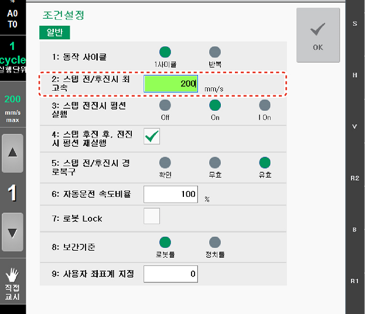

# 2.1.2    운전 속도 조정

수동 모드에서는 스텝 전후진 운전과 수동 조그 조작을 이용해 로봇을 조작합니다. Hi6 티치 펜던트 화면 좌측의 기능 버튼으로 스텝의 전후진 제한 속도\(\)와 조그의 속도 레벨\(\)을 확인하고 조절할 수 있습니다.

스텝의 제한 속도를 설정하려면, \[속도조절\] 버튼을 터치한 후 설정창에서 속도값을 입력하십시오. 스텝 전후진 제한 속도는 \[속도조절\] 버튼에 단위\(㎜/sec\)와 함께 숫자로 표시됩니다. 로봇 툴과 링크의 최고 속도는 제한 속도 이하로 제한됩니다.

예를 들어, 수동 모드의 제한 속도가 250 ㎜/s로 설정되어 있고 기록된 스텝의 속도가 1000 ㎜/s일 경우 스텝 전후진 운전 시 스텝의 이동 속도는 250 ㎜/s로 제한됩니다. 기록 속도가 100 ㎜/s 일 경우, 기록 속도가 제한 속도를 초과하지 않으므로 로봇은 100 ㎜/s로 이동합니다.


자동 모드일 때, \[속도조절\] 버튼에는 스텝 제한 속도\(㎜/sec\) 대신 재생 속도\(%\)가 표시됩니다.


조그 속도 레벨\(1: 저속~8: 고속\)을 설정하려면, 원하는 속도 레벨이 나타날 때까지 \[/\] 버튼을 반복하여 터치하십시오. 조그 속도 레벨은 \[/\] 버튼 사이에 숫자로 표시됩니다. 이 때에도 로봇 툴과 링크의 최고 속도는 제한 속도 이하로 제한됩니다.


\[주의\] 툴 데이터의 길이와 각도가 실제와 다르게 설정되어 있으면 수동 모드에서 툴이 너무 빠르게 동작할 수 있습니다. 로봇을 조작하기 전에 반드시 툴 데이터가 올바르게 설정되어 있는지 확인하십시오.


