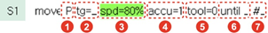

# 2.3.1 Step Statement Parameters

The step statement parameters are the movement conditions required for the step movement of the robot, such as the robot position, interpolation, speed, accuracy, and tool number of the robot, in addition to move, a movement command.

Parameters of the step statement are divided into default parameters and optional parameters. The default parameters are the essential ones for a step, and the optional parameters are the ones that can be added when necessary. 

The step statement is configured as follows.

<table>
  <thead>
    <tr>
      <th style="text-align:left">No.</th>
      <th style="text-align:left">Parameter</th>
      <th style="text-align:left">Description</th>
    </tr>
  </thead>
  <tbody>
    <tr>
      <td style="text-align:left">
        
      </td>
      <td style="text-align:left">Interpolation</td>
      <td style="text-align:left">
        
Interpolated path between steps

        
P (Joint interpolation), L (Linear interpolation), C (Circular interpolation),
          SP (Stationary tool interpolation off), SL (Stationary tool linear interpolation),
          SC (Stationary tool circular interpolation)

      </td>
    </tr>
    <tr>
      <td style="text-align:left">
        
      </td>
      <td style="text-align:left">Pose</td>
      <td style="text-align:left">
        
A parameter to record a position. This parameter may be omitted, and a
          pose may be designated after the statement (hidden pose).

        
Target pose (X, Y, Z, Rx, Ry, Rz, Cfg) {Coordinate system} + Shift (X,
          Y, Z, Rx, Ry, Rz) {Coordinate system}

      </td>
    </tr>
    <tr>
      <td style="text-align:left">
        
      </td>
      <td style="text-align:left">Speed</td>
      <td style="text-align:left">Operation speed of the robot (Unit: mm/sec, cm/min, %, sec)</td>
    </tr>
    <tr>
      <td style="text-align:left">
        
      </td>
      <td style="text-align:left">Accuracy</td>
      <td style="text-align:left">A value of the allowable error (0&#x2013;7) between the current position
        and the recorded position that occurs when the robot moves to the target
        step</td>
    </tr>
    <tr>
      <td style="text-align:left">
        
      </td>
      <td style="text-align:left">Tool number</td>
      <td style="text-align:left">Number of the tool in use (0&#x2013;31)</td>
    </tr>
    <tr>
      <td style="text-align:left">
        
      </td>
      <td style="text-align:left">Stop condition</td>
      <td style="text-align:left">A condition for the robot to stop moving to execute the next command (step
        or function)</td>
    </tr>
    <tr>
      <td style="text-align:left">
        
      </td>
      <td style="text-align:left">Comment</td>
      <td style="text-align:left">Description of the step</td>
    </tr>
  </tbody>
</table>

