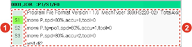
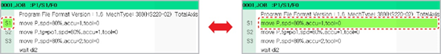

# 3.2.3 Statement Configuration

A statement consists of an address area and a statement area. 

| No. | Area | Description |
| :--- | :--- | :--- |
|  | Address area | Displays the line number \(1 to 9999\) and step number \(S1 to S999\) |
|  | Statement area | Displays a statement |

You can move the cursor position between the address area and the statement area by pressing the &lt;←/→&gt; key on the teach pendant. Pressing the &lt;↓/↑&gt; key will allow you to move the cursor up and down between the lines within the selected area.

