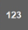
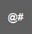

# 3.2.4.4 Soft Keyboard

You can easily input variables, expressions, and strings using the soft keyboard on the Hi6 teach pendant screen.

1.	Touch the \[ \] button on the log bar of the Hi6 teach pendant screen. Then, a soft keyboard will appear at the bottom of the screen.

2.	You can input variables, expressions, and strings in the input area using the soft keyboard. The existing parameter values will be removed, and the inputted texts will be displayed.

* If you touch the \[ / \] button on the left side of the input area, you can move the cursor position, allowing you to insert the text at the desired position.
* You can input numbers and special characters by touching the \[/\] button.
* 
  You can change the input language by touching the \[\] button.

* 
  You can input a capital letter or a symbol by touching the key while pressing the &lt;shift&gt; key on the teach pendant.

* 
  You can move the keyboard to the top of the screen by touching the \[\] button.

3.	When you have finished editing the text, you can hide the soft keyboard by touching the \[\] button at the bottom right of the soft keyboard.

