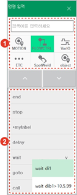

# 3.2.2.1 일반 명령문 입력

1.	수동 모드에서 초기 화면 우측의 \[명령입력\] 버튼을 터치하십시오. 명령 입력창이 나타납니다.

2.	명령문 그룹을 터치하거나 명령어를 입력한 후 목록에서 명령어를 선택하십시오. 현재 커서 위치의 바로 아래에 명령문이 입력됩니다.

* 여러 개의 인수 형태를 가진 명령어의 경우, 우측에 체크 표시\( V \)가 나타납니다. 목록에서 명령어를 터치하면 인수 형태를 확인하고 선택할 수 있습니다.
* 각 명령문에 대한 자세한 내용은 별도의 “[Hi6 로봇언어 기능 설명서](https://hyundai-robotics.gitbook.io/hi6-robot-language/)”를 참조하십시오.

