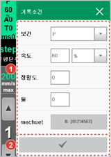
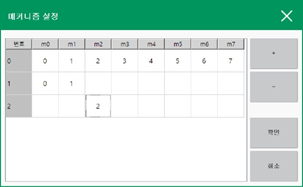

# 3.2.2.3 기록 조건

\[기록\] 버튼으로 명령문을 입력하면 로봇의 현재 자세가 타겟 포즈로 기록되고 이동 명령\(move\) 인수는 \[기록조건\] 버튼으로 미리 설정한 값이 적용됩니다. 명령문의 기록 조건을 설정하는 방법은 다음과 같습니다.

1.	Hi6 티치 펜던트 화면 좌측의 \[기록조건\] 버튼을 터치하십시오. 기록 조건 설정창이 나타납니다.

 2.	보간, 이동 속도와 단위, 정밀도, 툴 번호, 메커니즘 세트를 설정한 후 \[확인\] 버튼\( \)을 터치하십시오.

* 위치 기록 시, 기록 조건에 설정한 조건을 기준으로 이동 명령문이 기록됩니다.
* 메커니즘 세트에서는 위치 기록 시 저장할 메커니즘의 구성을 지정합니다.
  * \[메커니즘 세트\] 버튼을 짧게 터치하면, 사전에 정의된 메커니즘 세트 번호가 순차적으로 나타납니다.
  * \[메커니즘 세트\] 버튼을 길게 터치하면, 메커니즘 세트 설정창에서 기존의 세트 구성을 수정하거나 \[+\] 또는 \[-\] 버튼을 이용하여 메커니즘 세트를 추가 및 삭제할 수 있습니다.

