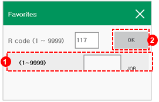

# 8.4 R117 for Deleting a Program

You can individually delete the programs in the internal memory.

1.	After inputting 117 in the favorites window, touch the \[OK\] button or press the &lt;enter&gt; key.

2.	After inputting the number of the program that you want to delete, touch the \[OK\] button or press the &lt;enter&gt; key. Then, the deletion confirmation window will appear.

* If there is no file to delete, a notification message \(“No File Exists.”\) will appear. 
* If you want to delete a protected program, a notification message \(“A Protected File.”\) will appear.

3.	In the deletion confirmation window, touch the \[OK\] button or press the &lt;enter&gt; key. Then, the selected program will be deleted.


The R117 code cannot be used in automatic mode. It must be used in manual mode.


