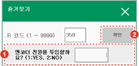

# 8.13 R359 서보툴 엔코더 전원 ON Relay

서보툴 체인지 시스템에서 서보건을 적용한 경우, 최초 서보건 장착 시 서보건 축의 엔코더를 리셋하기 위해 실행합니다.

1.	즐겨찾기 창에서 359를 입력한 후 \[확인\] 버튼을 터치하거나 &lt;enter&gt; 키를 누르십시오.

2.	1을 입력한 후 \[확인\] 버튼을 터치하거나 &lt;enter&gt; 키를 누르십시오. 엔코더에 전원이 투입됩니다.


* 자동 모드에서는 R359 코드를 사용할 수 없습니다. 반드시 수동 모드에서 사용하십시오.
* 서보건 엔코더의 강제 전원 투입을 해제하려면 제어기의 전원을 끈 후 다시 켜야 합니다. 따라서 엔코더 리셋이 종료되면 제어기의 전원을 껐다 켠 후 서보건 수동 결합을 진행하십시오.
* 서보툴 엔코더 전원 설정 기능은 일반 사용자에게 지원되지 않는 엔지니어용 기능입니다. 이 기능에 대한 자세한 내용은 엔지니어에게 문의하시기 바랍니다.
* 서보툴 엔코더 전원 설정에 대한 자세한 내용은 “Hi6제어기 스폿용접 기능 설명서”를 참조하십시오.



엔코더 전원이 강제로 투입된 상태에서는 절대 서보건을 기계적으로 결합하거나 분리하지 마십시오.


