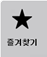

# 8.1 R 코드 사용

R코드를 이용하여 지정된 기능을 실행하는 방법은 다음과 같습니다.

1.	Hi6 티치 펜던트 화면 우측의 \[즐겨찾기\] 버튼을 터치하십시오. 즐겨찾기 창이 나타납니다. 

2.	목록에서 코드 번호를 선택하거나 입력 영역에 코드 번호를 입력한 후 \[확인\] 버튼을 터치하거나 &lt;enter&gt; 키를 누르십시오. 선택한 R코드에 지정된 기능이 실행됩니다.

