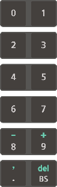

# 1.1.2 Teach Pendant

TP600 and TP630 teach pendants are supported. This operation manual describes how to use a teach pendant based on the TP600 model.

TP600 is a model developed exclusively for the Hi6 controller and provides a large touch screen.

<table>
  <thead>
    <tr>
      <th style="text-align:left">No.</th>
      <th style="text-align:left">Name</th>
      <th style="text-align:left">Description</th>
    </tr>
  </thead>
  <tbody>
    <tr>
      <td style="text-align:left">
        
      </td>
      <td style="text-align:left">Operation key</td>
      <td style="text-align:left">Controls the robot&#x2019;s operation, inputs commands, or selects a menu</td>
    </tr>
    <tr>
      <td style="text-align:left">
        
      </td>
      <td style="text-align:left">Display</td>
      <td style="text-align:left">The touch screen enables you to check and change the operation status
        and set the information of the robot.</td>
    </tr>
    <tr>
      <td style="text-align:left">
        
      </td>
      <td style="text-align:left">Mode switch</td>
      <td style="text-align:left">You can turn the mode switch to select the operation mode (
        manual,
        automatic,
        remote). If you remove the mode switch from the teach pendant, the selected
        operation mode will be locked.</td>
    </tr>
    <tr>
      <td style="text-align:left">
        
      </td>
      <td style="text-align:left">Emergency stop switch</td>
      <td style="text-align:left">Causes the robot to stop operating when pressed in case of an emergency</td>
    </tr>
    <tr>
      <td style="text-align:left">
        
      </td>
      <td style="text-align:left">Jog dial</td>
      <td style="text-align:left">Can be used to set the menu</td>
    </tr>
    <tr>
      <td style="text-align:left">
        
      </td>
      <td style="text-align:left">Mounting bracket</td>
      <td style="text-align:left">Holds or hangs the teach pendant to store it</td>
    </tr>
    <tr>
      <td style="text-align:left">
        
      </td>
      <td style="text-align:left">Enabling switch</td>
      <td style="text-align:left">
        
A switch that is to be used as a safety switch when operating the robot
          with the teach pendant in manual mode

        <ul>
          <li>Stage 1, Stage 3: The robot operation will stop. In the case of Stage
            3, the switch will recover to Stage 1 without going through Stage 2.</li>
          <li>Stage 2: You can operate the robot.</li>
        </ul>
      </td>
    </tr>
    <tr>
      <td style="text-align:left">
        
      </td>
      <td style="text-align:left">Cable connection connector</td>
      <td style="text-align:left">A connector for connecting the cable to the controller</td>
    </tr>
    <tr>
      <td style="text-align:left">
        
      </td>
      <td style="text-align:left">USB connection port</td>
      <td style="text-align:left">Can be used to connect a device that can be accessed by USB communication
        such as a transportable storage device</td>
    </tr>
  </tbody>
</table>

TP630 is a model to which the same operation key usage environment as that of the existing Hi5a controller is applied, and it provides a screen with a layout similar to that of the TP600.

#### Operation Keys

<table>
  <thead>
    <tr>
      <th style="text-align:left">Operation Key</th>
      <th style="text-align:left">Name</th>
      <th style="text-align:left">Description</th>
    </tr>
  </thead>
  <tbody>
    <tr>
      <td style="text-align:left">
        
      </td>
      <td style="text-align:left">shift</td>
      <td style="text-align:left">
        <ul>
          <li>Pressing the <b>&lt;shift&gt;</b> key together with a specific key will
            switch the function of the specific key.</li>
          <li>You can switch the current screen in use by pressing this key together
            with the <b>&lt;&#x2191;/&#x2193;&gt; </b>key in the JOB editing window.</li>
        </ul>
      </td>
    </tr>
    <tr>
      <td style="text-align:left">
        
      </td>
      <td style="text-align:left">ctrl</td>
      <td style="text-align:left">Pressing the <b>&lt;ctrl&gt;</b> key together with a specific key will execute
        the function defined for the specific key.</td>
    </tr>
    <tr>
      <td style="text-align:left">
        
      </td>
      <td style="text-align:left">up/down</td>
      <td style="text-align:left">Pressing the <b>&lt;&#x2193;/&#x2191;&gt; </b>key in manual mode will make
        it possible to move forward and backward in the unit of step.</td>
    </tr>
    <tr>
      <td style="text-align:left">
        
      </td>
      <td style="text-align:left">stop</td>
      <td style="text-align:left">
        
Pressing the <b>&lt;stop&gt;</b> key will temporarily stop the robot in
          automatic operation.

        <ul>
          <li>When the robot stops, the stop lamp will be turned on, and the start lamp
            will be turned off.</li>
          <li>As the robot is stopped while executing the path of the created program,
            there is no risk of collision with peripheral devices.</li>
        </ul>
      </td>
    </tr>
    <tr>
      <td style="text-align:left">
        
      </td>
      <td style="text-align:left">start</td>
      <td style="text-align:left">Pressing the <b>&lt;start&gt;</b> key will start the automatic operation
        of the program created in the robot. When the robot starts operation in
        automatic mode, the start lamp will be turned on, and the stop lamp will
        be turned off.</td>
    </tr>
    <tr>
      <td style="text-align:left">
        
      </td>
      <td style="text-align:left">motor</td>
      <td style="text-align:left">
        
You can supply the servo power to the motor of each axis of the robot.

        <ul>
          <li>Pressing the <b>&lt;motor&gt;</b> key in manual mode will make the motor
            lamp blink.</li>
          <li>Pressing the <b>&lt;motor&gt;</b> key in automatic mode will turn on the
            motor lamp.</li>
        </ul>
      </td>
    </tr>
    <tr>
      <td style="text-align:left">
        
      </td>
      <td style="text-align:left">enter</td>
      <td style="text-align:left">
        <ul>
          <li>If you press the <b>&lt;enter&gt;</b> key when inputting a number, the input
            value will be applied to the setting.</li>
          <li>If you press the <b>&lt;enter&gt;</b> key for a response of Yes/No, Yes
            will be selected.</li>
          <li>When editing a statement in manual mode, if you press the <b>&lt;enter&gt;</b> key
            while in the statement cursor, the cursor will switch to the word cursor
            that enables you to edit the parameters of the statement.</li>
        </ul>
      </td>
    </tr>
    <tr>
      <td style="text-align:left">
        
      </td>
      <td style="text-align:left">esc</td>
      <td style="text-align:left">
        <ul>
          <li>Allows you to cancel the key input or various functions in progress</li>
          <li>Pressing the <b>&lt;esc&gt;</b> key allows you to switch to a higher level
            without saving the changes.</li>
        </ul>
      </td>
    </tr>
    <tr>
      <td style="text-align:left">
        
      </td>
      <td style="text-align:left">left/right</td>
      <td style="text-align:left">
        <ul>
          <li>Allows you to move the cursor to previous or next when inputting texts</li>
          <li>If you press the <b>&lt;&#x2190;/&#x2192;&gt;</b> key in the word cursor
            status, you can move to the recorded step or other function parameters.</li>
        </ul>
      </td>
    </tr>
    <tr>
      <td style="text-align:left">
        
      </td>
      <td style="text-align:left">
        
number key

        

        

        

        

        

        

        

        

        
jog key

      </td>
      <td style="text-align:left">
        <ul>
          <li>You can input a number.</li>
          <li>If you press this key together with the <b>&lt;shift&gt; </b>key, you can
            input a sign (- / +) or comma (,), or delete a statement or parameter.</li>
          <li>
            
&lt;BS&gt;: Backspace allows you to erase the characters of the text one
              by one at the position of the cursor input. Moreover, if you select parameters
              when editing command and then press the <b>&lt;BS&gt;</b> key, you can delete
              the entire parameter values.

            

          </li>
        </ul>
        
While the motor is turned on in manual mode and the enabling switch is
          held, the &lt;enter /esc / &#x2190;/ &#x2192; &gt; keys and number keys
          will be operated as &#x201C;jog keys.&#x201D;

        <ul>
          <li>The axis name designated to each key will be displayed on the right edge
            of the display.</li>
          <li>The &lt;&#x2192;&gt; key is for the direction of increase (+), and the
            &lt;&#x2190;&gt; key is for the direction of decrease (-).</li>
        </ul>
      </td>
    </tr>
  </tbody>
</table>

