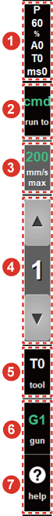
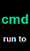
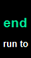
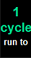
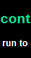
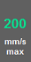

# 1.2.4.3 Function Buttons

<table>
  <thead>
    <tr>
      <th style="text-align:left"></th>
      <th style="text-align:left">No.</th>
      <th style="text-align:left">Description</th>
    </tr>
  </thead>
  <tbody>
    <tr>
      <td style="text-align:left"></td>
      <td style="text-align:left">
        
      </td>
      <td style="text-align:left">
        
<b>[Recording Condition]</b> button: You can set the basic value of the
          recording condition for the move statement.

        
After touching the <b>[Recording Condition]</b> button, you need to input
          data related to the interpolation, moving speed and unit, accuracy, and
          tool number in the setting window, and then touch the [<b>OK] </b>button
          (
          ).

      </td>
    </tr>
    <tr>
      <td style="text-align:left">
        
      </td>
      <td style="text-align:left">
        
      </td>
      <td style="text-align:left">
        
<b>[Execution Unit]</b> button: You can set the program execution unit
          in manual or automatic mode.

        

        
Manual mode: Touch the [run to] button repeatedly until the desired option
          appears.

        <ul>
          <li>
            [cmd]: Will execute the command line by line</li>
          <li>
            [step]: Wil execute step by step</li>
          <li>
            [end]: Will execute up to the end statement</li>
        </ul>
        

        
Automatic mode: After touching the [run to] button, set the option in
          the setting window.

        <ul>
          <li>
            [1 cycle]: Will execute up to the end statement before stopping</li>
          <li>
            [cont]: Will execute up to the end statement and then execute again starting
            from Step 0</li>
        </ul>
      </td>
    </tr>
    <tr>
      <td style="text-align:left"></td>
      <td style="text-align:left">
        
      </td>
      <td style="text-align:left">
        
<b>[Speed Adjustment]</b> button: You can set the step speed for user safety.

        
After touching the <b>[Speed Adjustment]</b> button, set the maximum step
          forward/backward speed and the automatic operation speed ratio in the setting
          window.

        <ul>
          <li>
            Manual mode: Displays the speed limit of a step forward/backward (mm/sec)</li>
          <li>
            Automatic mode: Displays the playback speed (%)</li>
        </ul>
      </td>
    </tr>
    <tr>
      <td style="text-align:left"></td>
      <td style="text-align:left">
        
      </td>
      <td style="text-align:left">
        
<b>[Jog Speed Level / Jog Inching]</b> button: You can set the speed level
          of each axis or of the cartesian jog and the use mode of the jog key.

        <ul>
          <li>[
            /
            ]: Touch the button repeatedly until the desired speed level of each axis
            or of the cartesian jog (1: Low speed &#x2013; 8: High speed) appears.
            With a long touch of the button, you can set the lowest or highest level
            at once.</li>
          <li>
            
            [1]: Touching the level value will display an inch mark on the top left
            of the level value, and the mode will switch to the inching mode. Touch
            the level value to return to normal mode. Then, the inch mark will disappear.</li>
        </ul>
      </td>
    </tr>
    <tr>
      <td style="text-align:left"></td>
      <td style="text-align:left">
        
      </td>
      <td style="text-align:left">
        
<b>[Tool]</b> button: You can check and set the selected tool number.

        
After touching the <b>[Tool]</b> button, input the tool number in the setting
          window and then touch the <b>[OK]</b> button.

      </td>
    </tr>
    <tr>
      <td style="text-align:left"></td>
      <td style="text-align:left">
        
      </td>
      <td style="text-align:left">
        
        <b>[Gun] </b>button: You can check the selected gun number and set the
        gun to an ON/OFF state. Check the gun number and touch the <b>[Gun]</b> button.
        Then, the gun will switch to an ON or OFF state, and the color of the button
        will change.</td>
    </tr>
    <tr>
      <td style="text-align:left"></td>
      <td style="text-align:left">
        
      </td>
      <td style="text-align:left">[Help] button: Displays detailed information about the selected statement
        or an error message or a warning message</td>
    </tr>
  </tbody>
</table>


* Jog inching mode: In normal mode, the robot keeps moving while you are pressing the jog key, but in inching mode, the robot moves only as much as the set value of each inching level and then stops, so you can operate the robot in detail.
* Gun
* It will determine whether to record the gun squeeze operation during the step recording process when you use spot welding. When this button is pressed together with the &lt;shift&gt; key, the GUN signal will be outputted manually.
* When you use arc welding, if the lamp is on during automatic operation, arc welding will be progressed. If the lamp is off, arc welding will not be progressed, but only the taught trajectory will be checked.


