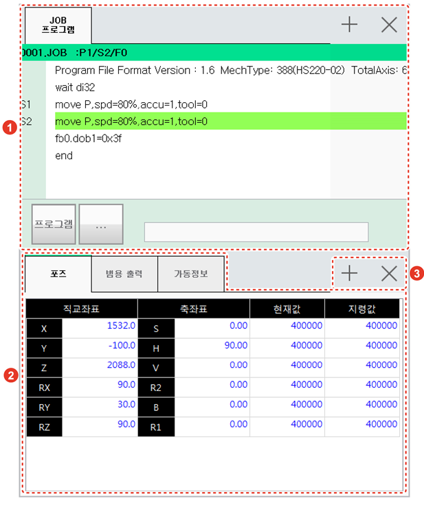

# 1.2.4.5 작업 영역

JOB 프로그램을 편집하고 모니터링 정보를 확인하는 등 다양한 작업을 수행하는 작업 영역입니다.

<table>
  <thead>
    <tr>
      <th style="text-align:left">번호</th>
      <th style="text-align:left">설명</th>
    </tr>
  </thead>
  <tbody>
    <tr>
      <td style="text-align:left">
        
      </td>
      <td style="text-align:left">
        
작업 영역은 상하, 두 개의
          패널 스택으로 기본 구성됩니다.

        <ul>
          <li>각 패널 스택에 패널창을
            추가하여 여러 작업을
            동시에 수행할 수 있습니다.</li>
          <li>기존 패널 스택의 상단과
            하단에 또는 패널 스택
            사이에 새 패널 스택을
            추가할 수 있습니다.</li>
        </ul>
      </td>
    </tr>
    <tr>
      <td style="text-align:left">
        
      </td>
      <td style="text-align:left">
        
패널 스택입니다. 현재
          열려 있는 모든 패널의
          이름이 표시되며 선택된
          패널창이 하단에 나타납니다.

        <ul>
          <li>패널명을 터치하여 선택한
            후 원하는 위치로 끌어
            놓으면 패널창의 순서를
            바꿀 수 있습니다.</li>
          <li>패널명을 터치하여 선택한
            후 다른 패널 스택으로
            끌어 놓으면 패널창의
            위치를 다른 패널 스택으로
            이동할 수 있습니다.</li>
          <li>패널명을 터치하여 선택한
            후 기존의 패널 스택 외
            다른 위치로 끌어 놓으면
            새 패널 스택이 추가되고
            패널창이 새 패널 스택에서
            열립니다.</li>
        </ul>
      </td>
    </tr>
    <tr>
      <td style="text-align:left">
        
      </td>
      <td style="text-align:left">
        <ul>
          <li>[+]: 패널 선택창에서 원하는
            모니터링 항목을 선택하여
            새 패널창으로 엽니다.
            패널창은 패널 스택에
            탭으로 추가됩니다.</li>
          <li>[X]: 선택한 패널창을 닫습니다.
            패널 스택에 패널창이
            하나만 있을 경우에는
            해당 패널창을 닫을 수
            없습니다.</li>
        </ul>
      </td>
    </tr>
  </tbody>
</table>

