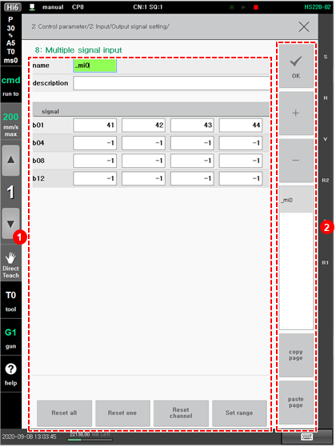

# 7.3.2.11 Multiple Signals Input

Input signals \(up to 16 signals\) can be created as a group, and data can be acquired through individual signals.

The data is in binary format and will be determined by the input on or off. For example, if di41 and di43 are on and all other signals are off, the data will be 0101 \(5 in decimal\).

1.	Touch the \[2: Control Parameter &gt; 2: Input/Output Signal Setting &gt; 8: Multiple Signal Input\] menu.

2.	Set the name, signals, and strobe of the input signal group.

<table>
  <thead>
    <tr>
      <th style="text-align:left">No.</th>
      <th style="text-align:left">Description</th>
    </tr>
  </thead>
  <tbody>
    <tr>
      <td style="text-align:left">
        
      </td>
      <td style="text-align:left">
        
Detailed information on the group selected from the input signal group
          list. You can set the name, description and signal of the group.

        <ul>
          <li><b>[Reset All]</b>/<b>[Reset One]</b>: You can reset the set value of
            all signals or of a selected signal to -1.</li>
          <li><b>[Reset Channel]</b>: You can reset the input channel of the set signal
            (0&#x2013;9: digital signals)</li>
          <li><b>[Set Range]</b>: You can quickly set the signal by designating the
            start and end signals.</li>
        </ul>
      </td>
    </tr>
    <tr>
      <td style="text-align:left">
        
      </td>
      <td style="text-align:left">
        <ul>
          <li>[OK]: You can save the edited content.</li>
          <li>[+]/[-]:You can add a new input signal group or delete an input signal
            group.</li>
          <li>This shows a list of input signal groups. Selecting a group name allows
            you to check and edit details.</li>
          <li><b>[Copy Page]</b>/<b>[Paste Page]: </b>You can copy the input signal
            group information and paste it to another group.
             Select the name of the group to be copied from the list, touch the <b>[Copy Page]</b> button,
            select the name of the group to which the value is to be applied, and touch
            the <b>[Paste Page] </b>button.</li>
        </ul>
      </td>
    </tr>
  </tbody>
</table>

For example, when a job program configured as the setting in the screen above is executed, the operation will be as follows.

After starting from S1 toward S2, the robot executes the wait statement. If the wait condition is satisfied before the accuracy of S2 is ok, the robot will move to the path in red. If this is not the case, the robot will wait until the wait condition is satisfied.

