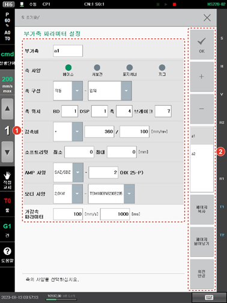

# 7.6.5 부가축 파라미터 설정

로봇 외에 사용할 수 있는 부가축에는 로봇의 베이스축\(주행축\), 서보건축, 포지셔너축, 지그축이 있습니다. 부가축 사양별 상세 내용은 “부가축 기능 설명서”를 참조하십시오.

사용 중인 부가축의 사양 및 구성 등 파라미터를 설정하는 방법은 다음과 같습니다.

1. \[5: 초기화 &gt; 5: 부가축 파라미터 설정\] 메뉴를 터치하십시오.
2. 부가축의 사양 및 구성 등 파라미터를 설정하십시오.

<table>
  <thead>
    <tr>
      <th style="text-align:left">번호</th>
      <th style="text-align:left">설명</th>
    </tr>
  </thead>
  <tbody>
    <tr>
      <td style="text-align:left">
        
      </td>
      <td style="text-align:left">
        
부가축의 상세 파라미터
          설정 정보입니다. 부가축
          이름과 사양, 구성 등을
          확인하고 설정할 수 있습니다.

        <ul>
          <li>[부가축]: 사용 중인 부가축의
            이름입니다.</li>
          <li>[축 사양]: 부가축의 사양입니다.
            사양에 따라 부가축 용도별로
            개발된 별도의 기능을
            사용할 수 있습니다.</li>
          <li>[축 구성]: 부가축의 메커니즘
            형태입니다. 일부 축 사양에는
            사전에 등록된 메커니즘
            형태를 지정할 수 있습니다.
            대표적으로 포지셔너의
            경우 표준 포지셔너 모델을
            선택할 수 있습니다.</li>
          <li>[축 위치]: DSP 보드에서 해당
            축이 연결된 위치입니다.
            배선이 연결된 사양에
            따라 BD 번호, DSP 번호, 축 번호,
            브레이크 번호를 순차적으로
            배선된 사양에 따라 지정합니다.</li>
          <li>[감속비]: 부가축 모터와
            링크의 감속비 정보입니다.
            <ul>
              <li>감속비 부호는 부가축
                링크가 (+) 방향으로 움직일
                때의 모터 샤프트의 회전
                방향에 따라 설정합니다.
                샤프트를 정면에서 보았을
                때 반시계방향(CCW)으로
                회전하면 (+) 부호, 시계방향(CW)으로
                회전하면 (-) 방향입니다.</li>
              <li>감속비 분자항의 파라미터는
                링크의 이동 거리(㎜ 또는
                deg)이며, 분모에 해당하는
                파라미터는 링크의 이동
                거리에 대응하는 모터의
                회전수입니다. 설정 항목의
                파라미터는 정수 형태로
                정의됩니다. 소수점으로
                나타나는 파라미터의
                경우 일정 배수를 분자와
                분모에 곱해 정수로 감속비를
                설정하십시오.</li>
            </ul>
          </li>
          <li>[소프트리밋]: 부가축의
            최소와 최대 동작 범위입니다.</li>
          <li>[AMP 사양]: 부가축 엠프 사양입니다.</li>
          <li>[모터 사양]: 부가축에
            연결된 모터의 모델명입니다.</li>
          <li>[가감속 파라미터]: 부가축의
            최고 속도와 가속 시간입니다.</li>
        </ul>
      </td>
    </tr>
    <tr>
      <td style="text-align:left">
        
      </td>
      <td style="text-align:left">
        <ul>
          <li>[OK]: 변경 내용을 저장합니다.</li>
          <li>[+]/[-]: 새로운 부가축을 추가하거나
            부가축을 삭제합니다.</li>
          <li>부가축 목록입니다. 부가축
            이름을 선택하면 상세
            파라미터를 확인 및 편집할
            수 있습니다.</li>
          <li>[페이지 복사]/[페이지
            붙여넣기]: 부가축 정보를
            복사하여 다른 부가축
            데이터에 붙여 넣습니다.
             목록에서 복사할 부가축
            정보의 이름을 선택하고
            [페이지 복사] 버튼을 터치한
            후 값을 적용할 부가축의
            이름을 선택하고 [페이지
            붙여넣기] 버튼을 터치하십시오.</li>
          <li>[회전 반경]: 부가축이
            회전축인 경우, 조그 시
            선속도 제한을 위한 회전
            반경을 설정합니다.</li>
        </ul>
      </td>
    </tr>
  </tbody>
</table>

