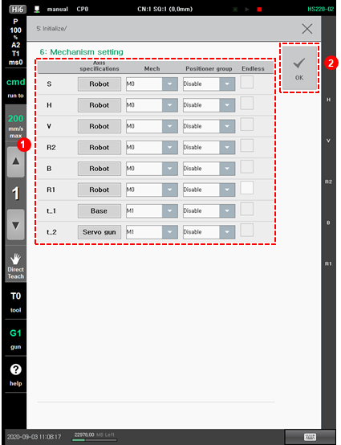

# 7.6.6 Mechanism Setting

Mechanism will be used as a group during the jog operation which the jog keys are to be assigned to. In addition, mechanism is also a set of units, each of which is to be differentiated in the process of recording or editing the position of a step. When the mechanisms are set, mechanism numbers \(M\#\) will be assigned for individual groups of axes.

The method to set the use of the endless function and set the position group is as follows.

1.	Touch the \[5: Initialize &gt; 6: Mechanism Setting\] menu.

2.	After setting the mechanism number, positioner group number, and the use of the endless function for each axis, touch the \[OK\] button.

* \[Mech\]: By touching the drop-down menu, you can set the mechanism number of the axis.
  * If the axis specification is a robot, the mechanism number will be fixed as M0.
  * 
    Starting with the additional axis, you can designate the mechanism number to a value ranging between M1 and M7.

  * 
    The axes set with the same mechanism number will be managed as the same group.

  * 
    To jog the additional axis, you can switch between mechanisms using the \[Mech\] button. At this time, if you press the jog key, jogging will take place in the order of the axes of the relevant mechanism.
* 
  \[Positioner Group\]: You can set the positioner group number. The position group number can be set only for the axes whose specification is set as positioner.

* 
  \[Endless\]: You can set whether to use the endless function on the axis.


A set mechanism unit is the minimum unit that can be assigned to each task and can be driven. To each task, a complex combination of mechanisms can be assigned to individual tasks.


#### 

#### Position Group Designation Rules

* Designate the group in order starting with the lower axis.
* 
  Designate the group not in sync as disable.

* 
  In the case of the positioner, only up to axis 2 will be supported for the same group. Do not designate axis 3 as the same group.

* 
  Redefining the group setting will disable the previously designated positioner calibration data, so you should execute the positioner calibration again.

#### Mechanism Jog Rules 

* The Hi6 controller provides eight jog keys in total.
* 
  Mechanisms will be utilized as one group during the jog operation.

* 
  If you select the mechanism number as \[M0\], the jog keys for the axes 7 and 8 will be operating as an exceptional case, and it is possible to operate M1 and M2 within a range in which the total number of axes including the next mechanism is eight or less. Even in this case, if you set the mechanism number as \[M1\], you can perform the jog operation for the configuration elements of M1. 

* 
  The following shows the example of the usage.

  Example 1\) M0: Robot \(Axes 1–6\). M1: Travel axis \(Axis 7\). M2: Servo gun \(Axis 8\)

  * Select \[M0\] ⇒ Jog key for axes 1–6: M0. Jog key for axis 7: M1. Jog key for axis 8: M2
  * Select \[M1\] ⇒ Jog key for axis 1: M1
  * Select \[M2\] ⇒ Jog key for axis 1: M2

  Example 2\) M0: Robot \(Axes 1–6\). M1: Travel axis \(Axis 7\). M2: Servo gun \(Axes 8–9\)

  * Select \[M0\] ⇒ Jog key for axes 1–6: M0. Jog key for axis 7: M1
  * Select \[M1\] ⇒ Jog key for axis 1: M1
  * Select \[M2\] ⇒ Jog key for axes 1–2: M2

  Example 3\) M0: Robot \(Axes 1–7\). M1: Travel axis \(Axis 8\). M2: Servo gun \(Axes 9–10\)

  * Select \[M0\] ⇒ Jog key for axes 1–7: M0. Jog key for axis 8: M1
  * Select \[M1\] ⇒ Jog key for axis 1: M1
  * Select \[M2\] ⇒ Jog key for axis 1: M2

