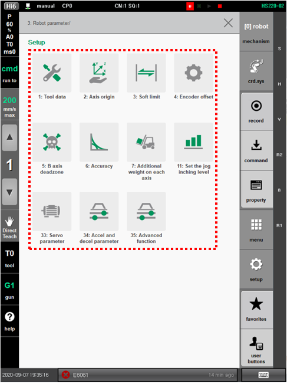

# 7.4 Robot Parameters

You can set various data related to robot operation as well as information such as the origin and operation range of each axis.

1.	Touch the \[3: Robot Parameter\] menu. Then, the robot parameter menu will appear. 

2.	You can check and set various parameters of the manipulator by selecting the desired menu.

