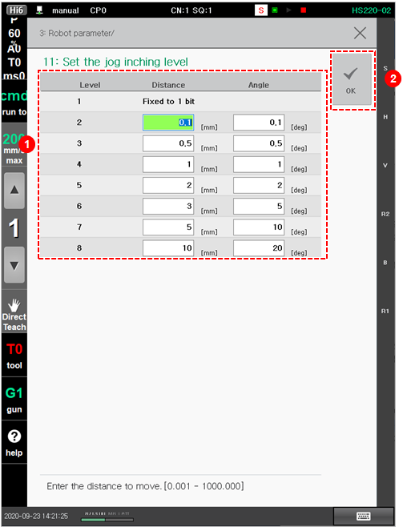

# 7.4.9 Jog Inching Level Setting

You can limit the operation by designating the moving distance. This is useful when you want to move the robot as much as the desired distance with the jog key in manual mode.

1.	Touch the \[3: Robot Parameter &gt; 11: Set the Jog Inching Level\] menu.

2.	After setting the distance and angle for each jog inching level, touch the \[OK\] button.

