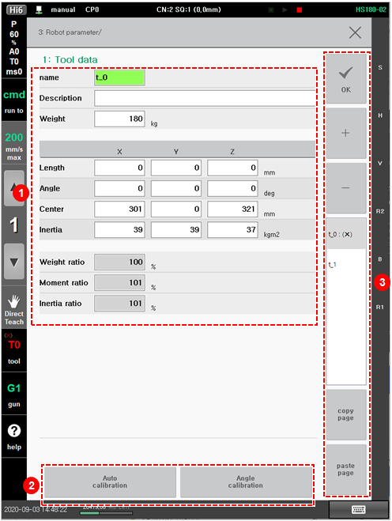
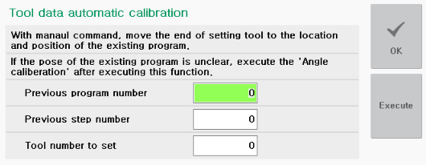
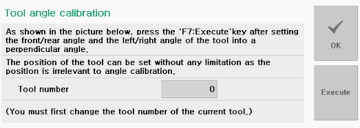

# 7.4.1.1 Tool Data Setting

The manual method of setting the distance and angle of TCP based on the robot’s R1-axis flange and registering the tool’s weight, center of gravity, and inertia is as follows.

1.	Touch the \[3: Robot Parameter &gt; 1: Tool Data\] menu.

2.	Set the tool data name, weight, detailed conditions of each axis, and allowable ratio.
_assets

<table>
  <thead>
    <tr>
      <th style="text-align:left">No.</th>
      <th style="text-align:left">Description</th>
    </tr>
  </thead>
  <tbody>
    <tr>
      <td style="text-align:left">
        
      </td>
      <td style="text-align:left">Detailed information on the tool data selected from the tool data list.
        You can set the tool data name and description, weight, detailed conditions
        of each axis, and allowable ratio.</td>
    </tr>
    <tr>
      <td style="text-align:left">
        
      </td>
      <td style="text-align:left">
        <ul>
          <li><b>[Auto Calibration]</b>: You can create new tool data or can create
            tool data simply by using an existing program. If you want to perform setting
            newly at the previously taught step position, you should first place the
            tool, and then execute the automatic calibration function to create tool
            length and angle newly.
             
            
             
          </li>
          <li>[Previous Program Number]: You can input the program number taught before
            tool deformation occurs.</li>
          <li>[Previous Step Number]: You can input the step number for which automatic
            tool data calibration will be performed.</li>
          <li>[Tool Number to Set]: You can input the tool number to be newly set.</li>
          <li>
            
[Angle Calibration]: You can calibrate the angle of the tool.

            

              
            

          </li>
        </ul>
      </td>
    </tr>
    <tr>
      <td style="text-align:left">
        
      </td>
      <td style="text-align:left">
        <ul>
          <li>[OK]: You can save the changes.</li>
          <li>[+]/[-]: You can add new tool data or delete tool data.</li>
          <li>Tool data list. Selecting a tool data name will allow you to check and
            edit detailed information.</li>
          <li>[Copy page]/[Paste page]: You can copy the tool data information and then
            paste it to another tool data.
             After selecting the name of the tool data information to be copied from
            the list and touching the<b> [Copy page] </b>button, select the name of
            the tool data to which the value is to be applied, and then touch the <b>[Paste page]</b> button.</li>
        </ul>
      </td>
    </tr>
  </tbody>
</table>


* In the tool data list, tool data for which load estimation is not performed will be marked with \(X\) to the right side of the name.
* You must perform load estimation first before using the tool. The use of tools for which load estimation is not performed could cause trouble with the speed and durability of the robot.
* 
  When tool data is copied, the load estimation data will also be copied. The tool data copying and pasting functions can only be executed on the tab of the tool number for which load estimation has been performed.


